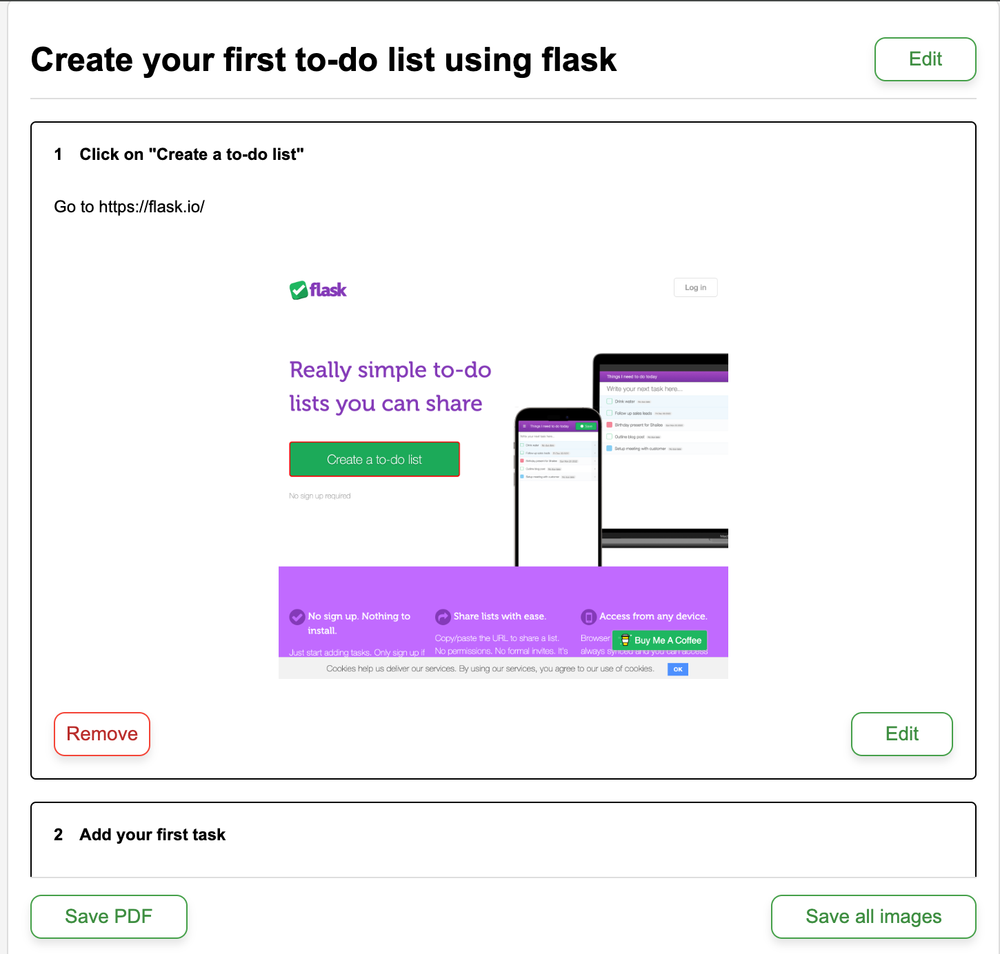

# Button Click Logger \- Chrome Extension

## Overview

Button Click Logger is a Chrome extension designed to help you capture, document, and share workflows directly within your browser. This tool enables users to record interactions on a webpage, reorganize and edit captured steps, and add detailed descriptions for each action. Once your workflow is complete, you can save it as a PDF or download individual images, providing a comprehensive visual record.

## Key Features

* **Capture Clicks:** Automatically logs each button click or interaction, capturing essential details like element text, URL, and timestamp.

* **Workflow Editing:** Customise your workflow by reordering steps, editing descriptions, and adding additional context to each action.

* **Download Options:** Save your workflow as a PDF for a complete overview, or download individual images of each interaction for more granular documentation.

* **Secure and Local Storage:** All captured data is stored locally on your device, ensuring your data remains private. Clearing the storage is easy, giving you complete control over your recorded data.

## Use Cases

Button Click Logger is ideal for:

* **Customer Support:** Record complex workflows and share them as PDFs with customers for clear, step-by-step guidance.

* **Help Documentation:** Capture detailed workflows to create visual guides and improve help site documentation.

* **UX Research:** Capture user workflows to analyze navigation patterns and improve usability.

* **Product Teams:** Document product workflows, feature interactions, and provide detailed reports to stakeholders.

* **QA Teams:** Record test flows and document issues visually for debugging and reporting.

Button Click Logger makes it easy for anyone to capture, review, and share browser workflows, enhancing collaboration and knowledge sharing across teams.

## Security and Privacy

* **Local Data Storage:** All data is stored locally on your device, ensuring that no information is shared or uploaded elsewhere.

* **Easy Data Management:** Clear your storage with a single click whenever you’re done, giving you full control over your data privacy.

## Output Formats

* **PDF Export:** Save the entire workflow as a structured PDF, with each step clearly documented.

* **Individual Images:** Download screenshots of each step to use independently or as part of a larger report.

Capture and share workflows securely with Button Click Logger — your tool for effortless, private, and controlled documentation.